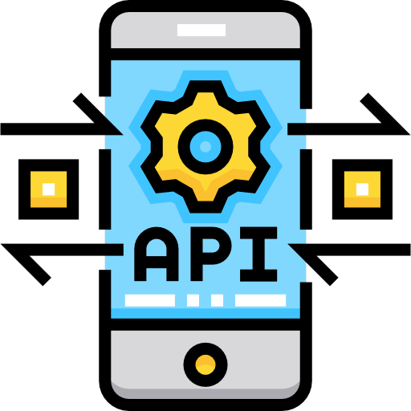

<h1
  align="center"
>
  
</h1>

<h3
  align="center"
>
  Rest API Project - A Simple API implementing the main features of the REST (Representational State Transfer) pattern with the Node.js, Express.js, PostgreSQL database, and Jest stack
</h3>
